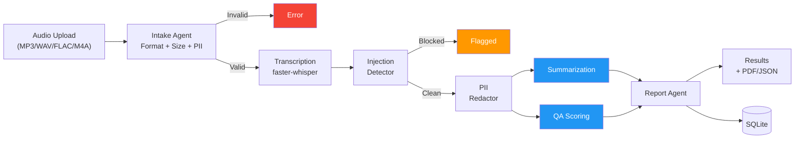
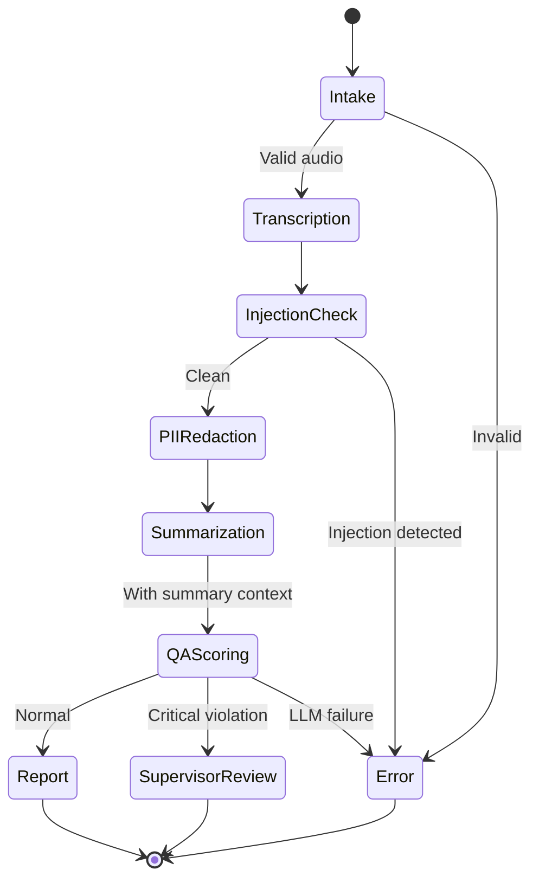
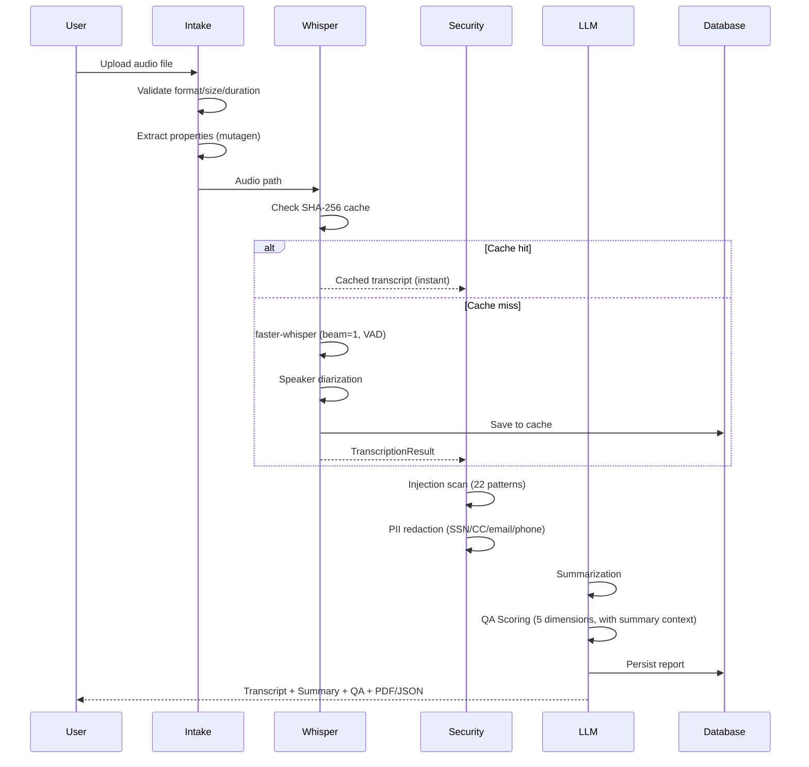
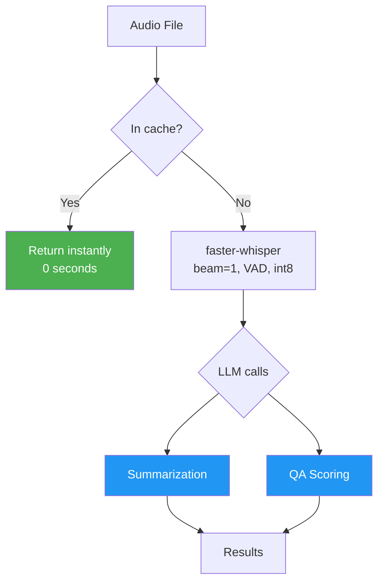
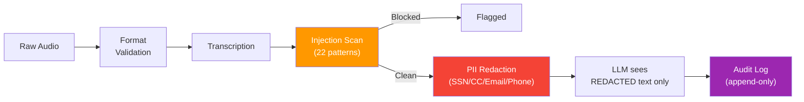

# Call Center Intelligence System

A production-grade, multi-agent AI pipeline that ingests raw call center audio and outputs structured transcripts, summaries, quality scores, compliance flags, and downloadable PDF/JSON reports.

Built with **LangGraph** orchestration, **faster-whisper** speech-to-text, and **LLM-powered** structured analysis (GPT-4o / Gemini / Groq).

[](https://huggingface.co/spaces/animeshkcm/call-center-intelligence)
[](https://github.com/ANI-IN/Call-Center-Intelligence-System)
[](https://www.python.org/downloads/)
[]()
[](https://creativecommons.org/licenses/by-nc/4.0/)

---

## Capstone Framing

### Problem Statement

Automated call center quality assurance using multi-agent AI pipelines.

### Business Use Case

A mid-size call center handles **~5,000 calls/day**. Quality assurance teams manually review **less than 5%**, spending ~15 minutes per call. This creates three systemic failures:

```
+------------------+     +-------------------+     +------------------+
|  COVERAGE GAP    |     |  CONSISTENCY GAP  |     |  LATENCY GAP     |
|                  |     |                   |     |                  |
|  95% of calls    |     |  40-60% inter-    |     |  Reviews surface |
|  get ZERO        |     |  rater agreement  |     |  problems DAYS   |
|  quality review  |     |  on same call     |     |  after the call  |
+------------------+     +-------------------+     +------------------+
```

| Metric | Manual QA | This System |
|--------|-----------|-------------|
| Call coverage | <5% | **100%** |
| Time per call | ~15 min | **2-5 min (CPU) / <30s (GPU)** |
| Consistency | 40-60% agreement | **Deterministic, reproducible** |
| Compliance detection | Days later | **Real-time** |
| Cost per call | ~$5 (labor) | **$0.03 (GPT-4o) / $0 (free tier)** |

### Evaluation Metrics

- **Coverage**: 100% of calls scored (vs <5% manual)
- **Consistency**: Deterministic scoring via weighted formula (Professionalism 15%, Empathy 20%, Problem Resolution 30%, Compliance 20%, Communication Clarity 15%)
- **Speed**: 2-5 min CPU, <30s GPU per call
- **Cost**: $0.03/call (GPT-4o) or $0 (free tier)
- **Security**: PII redacted before LLM exposure, 22 injection patterns blocked
- **Reliability**: Transcription caching, exponential backoff retries, graceful error handling

### Why It Matters for Software Engineers

This project demonstrates real-world engineering challenges beyond "wrap an LLM API":

- **Multi-agent orchestration** — LangGraph state machine with conditional routing, parallel execution, and error isolation
- **Security-first design** — PII redaction before LLM exposure, prompt injection detection in audio transcripts
- **Production patterns** — Transcription caching, connection pooling, graceful degradation, structured logging
- **Cost optimization** — Three LLM providers (paid + 2 free) switchable via single env var
- **Clean architecture** — 36-line entrypoint, services layer, UI layer, 113 tests

### Technical Complexity

| Dimension | Detail |
|-----------|--------|
| Pipeline stages | 7 (intake, transcription, injection check, PII redaction, summarization, QA scoring, report) |
| Pydantic models | 14 typed data contracts |
| LLM providers | 3 (OpenAI, Gemini, Groq) |
| Security checks | 22 injection patterns + 4 PII types |
| Test coverage | 113 tests across unit, integration, and security |
| Architecture layers | 5 (UI, services, agents, graph, database) |

### The Engineering Challenge

This is **not** a single-prompt LLM wrapper. It solves 5 distinct engineering problems:

1. **Audio-to-structured-data pipeline** — Raw 8kHz telephone audio to typed Pydantic objects across 7 processing stages
2. **Multi-agent coordination** — Conditional routing, parallel execution, retry logic, error isolation via LangGraph state machine
3. **Security boundary enforcement** — PII redaction before LLM exposure; prompt injection detection in audio transcripts
4. **Cost optimization** — Three LLM providers (paid + 2 free) switchable via single env var, zero code changes
5. **Production reliability** — Transcription caching, connection pooling, temp file lifecycle, graceful degradation

---

## System Architecture

### Pipeline Overview



> **Summarization** runs first, then **QA Scoring** receives the summary context for more accurate evaluation.

### State Machine



### Data Flow



---

## Pipeline Stages

| # | Stage | What It Does | Key Detail |
|---|-------|-------------|------------|
| 1 | **Intake** | Validates format (magic bytes), size (<50MB), duration (<60min) | Extracts properties via mutagen for all formats |
| 2 | **Transcription** | faster-whisper with int8 quantization, VAD filter, speaker diarization | SHA-256 caching — identical audio returns instantly |
| 3 | **Injection Detection** | Scans transcript for 22 prompt injection patterns | Blocks malicious audio from reaching LLM |
| 4 | **PII Redaction** | Removes SSN, credit card, email, phone from transcript | Applied BEFORE any LLM call |
| 5 | **Summarization** | Extracts purpose, key points, action items, sentiment, entities | Structured output via LLM |
| 6 | **QA Scoring** | Scores agent on 5 weighted dimensions (1-5 each) | Receives summary context for accurate evaluation |
| 7 | **Report** | Compiles PDF/JSON, persists to DB, audit log | Downloadable artifacts |

### QA Scoring Rubric

| Dimension | Weight | Measures |
|-----------|--------|----------|
| Professionalism | 15% | Language, greeting/closing, no interruptions |
| Empathy | 20% | Active listening, acknowledging feelings |
| Problem Resolution | 30% | Root cause, solution, confirmation |
| Compliance | 20% | Disclosures, verification, hold procedures |
| Communication Clarity | 15% | Clear explanations, jargon-free |

---

## Speed & Performance

### Processing Time by Hardware

| Hardware | 5-min call | 15-min call | Cost |
|----------|-----------|-------------|------|
| **CPU** (HF Spaces free) | 2-4 min | 5-10 min | Free |
| **NVIDIA T4** (HF Spaces) | 10-15 sec | 25-40 sec | $0.60/hr |
| **NVIDIA A10G** (AWS/GCP) | 5-10 sec | 15-25 sec | ~$1/hr |
| **NVIDIA A100** (RunPod) | 3-5 sec | 8-15 sec | ~$2/hr |

### Speed Optimizations



| Optimization | Impact | Detail |
|-------------|--------|--------|
| **Greedy decoding** (beam=1) | ~2x faster | Minimal quality loss on clear audio |
| **condition_on_previous_text=False** | Prevents stalls | Stops hallucination loops that slow decoding |
| **VAD filter** | 20-30% faster | Skips silent segments entirely |
| **int8 quantization** | 2-4x faster on CPU | CTranslate2 backend |
| **Sequential LLM with context** | Better QA accuracy | QA receives summary for informed scoring |
| **SHA-256 caching** | Instant on repeat | Identical audio skips transcription entirely |
| **No preprocessing** | 30-60s saved | faster-whisper handles resampling internally |
| **Cached DB sessions** | Microseconds | sessionmaker reused per engine |

### Whisper Model Comparison

| Model | Size | Speed (10-min, CPU) | Accuracy | Best For |
|-------|------|--------------------:|----------|----------|
| `tiny` | 39 MB | **~1 min** | Good | Free tier / quick results (default) |
| `base` | 139 MB | ~3 min | Better | Balanced speed + accuracy |
| `small` | 461 MB | ~8 min | High | Important calls, clear audio |
| `large-v3` | 3 GB | ~25 min CPU / **30s GPU** | Best | GPU deployments only |

> **Recommendation:** Use `tiny` on free CPU tier. Use `large-v3` with GPU for production accuracy.

### GPU Deployment Options

**HuggingFace Spaces** (easiest):
```
Space Settings -> Hardware -> T4 small ($0.60/hr)
Set: WHISPER_MODEL_SIZE=large-v3
```

**RunPod / Cloud GPU:**
```bash
git clone https://github.com/ANI-IN/Call-Center-Intelligence-System.git
cd Call-Center-Intelligence-System
pip install -e .
export WHISPER_MODEL_SIZE=large-v3
export OPENAI_API_KEY=sk-...
python app.py
```

faster-whisper auto-detects CUDA. No code changes needed — just set the model size and add a GPU.

---

## Technology Stack

| Layer | Technology | Why |
|-------|-----------|-----|
| Orchestration | **LangGraph** | Typed state machine, conditional routing, fan-out parallelism |
| Speech-to-Text | **faster-whisper** | CTranslate2, int8, 2-4x faster than vanilla Whisper |
| LLM (paid) | **GPT-4o** | Best structured output quality |
| LLM (free) | **Gemini 2.0 Flash** | 1,500 req/day free |
| LLM (free) | **Groq / Llama 3.3 70B** | 30 RPM free, fastest inference |
| Audio | **mutagen** | Property extraction for MP3/FLAC/M4A/WAV |
| Data Models | **Pydantic v2** | 14 typed contracts between all stages |
| Database | **SQLite + SQLAlchemy** | Single-file, ORM, transcription cache |
| Web UI | **Gradio** | 2-tab interface (Analyze + Observability) |
| Observability | **LangSmith** | Full trace logging |
| PDF | **ReportLab** | Report generation |
| Testing | **pytest** | 113 tests across unit, integration, security |
| Linting | **ruff + pre-commit** | Fast linting, secret scanning |

---

## Project Structure

```
call-center-intelligence/
|-- app.py                          # Thin entrypoint (~36 lines)
|-- pyproject.toml                  # Project config + dependencies
|-- requirements.txt                # HF Spaces deps
|-- Makefile                        # test, lint, format, run
|-- .env.example                    # Env var template
|
|-- src/
|   |-- agents/                     # Pipeline stages
|   |   |-- intake.py               #   Validation + PII scan
|   |   |-- transcription.py        #   Whisper STT + diarization + caching
|   |   |-- summarization.py        #   LLM summary extraction
|   |   |-- qa_scoring.py           #   5-dimension weighted scoring
|   |   +-- report.py               #   PDF/JSON + persistence
|   |-- graph/                      # LangGraph orchestration
|   |   |-- state.py                #   Pydantic models (14 types)
|   |   |-- workflow.py             #   State machine + parallel exec
|   |   +-- edges.py                #   Routing logic
|   |-- security/                   # Security layer
|   |   |-- pii_redactor.py         #   PII redaction (SSN/CC/email/phone)
|   |   |-- injection_detector.py   #   22-pattern injection defense
|   |   +-- audit.py                #   Append-only audit logging
|   |-- services/                   # Business logic (no UI deps)
|   |   |-- pipeline.py             #   process_call orchestration
|   |   +-- observability.py        #   Dashboard metrics
|   |-- ui/                         # Gradio presentation layer
|   |   |-- app_builder.py          #   Assembles all tabs
|   |   +-- tabs/
|   |       |-- analyze.py          #   Single call analysis
|   |       +-- observability.py    #   Metrics dashboard
|   |-- database/                   # Persistence
|   |   |-- models.py               #   ORM models
|   |   +-- connection.py           #   Engine + session_scope
|   +-- utils/                      # Shared utilities
|       |-- audio.py                #   Format detection + mutagen
|       |-- config.py               #   Env-based config
|       |-- llm_factory.py          #   Multi-provider factory
|       +-- formatters.py           #   Display formatting
|
|-- data/
|   +-- samples/                    # 10 sample call center audio files (MP3)
|
|-- tests/                          # 113 tests
|   |-- conftest.py                 #   Shared fixtures
|   |-- unit/                       #   Agents, models, services, utils
|   |-- integration/                #   End-to-end pipeline
|   +-- security/                   #   PII + injection tests
```

The clean architecture separates concerns across five layers: UI (`src/ui/`), business logic (`src/services/`), agent pipeline (`src/agents/`), graph orchestration (`src/graph/`), and persistence (`src/database/`). `app.py` is now a thin 36-line entrypoint that simply builds and launches the Gradio app.

---

## Getting Started

### Prerequisites

- Python 3.11+
- ffmpeg (`brew install ffmpeg` / `apt install ffmpeg`)
- At least one LLM API key

### Quick Start

```bash
git clone https://github.com/ANI-IN/Call-Center-Intelligence-System.git
cd Call-Center-Intelligence-System

python -m venv venv && source venv/bin/activate
pip install -e ".[dev]"

cp .env.example .env
# Set OPENAI_API_KEY or GOOGLE_API_KEY with LLM_PROVIDER=gemini

python app.py  # http://localhost:7860
```

### Sample Dataset

The repo includes 10 sample call center audio files in `data/samples/` for immediate testing:

```bash
ls data/samples/
# sample_01.mp3 through sample_10.mp3 (~30 MB total)
```

Upload any of these to the app's "Analyze Call" tab to test the full pipeline.

### Dev Commands

```bash
make test       # unit + security tests
make test-all   # 113 tests: unit + integration + security
make lint       # ruff check
make format     # auto-fix
make run        # start app
```

---

## Configuration

### LLM Provider (pick one)

```bash
# GPT-4o (default, ~$0.03/call)
LLM_PROVIDER=openai
OPENAI_API_KEY=sk-...

# Gemini 2.0 Flash (free, 1500 req/day)
LLM_PROVIDER=gemini
GOOGLE_API_KEY=AI...

# Groq Llama 3.3 70B (free, 30 RPM)
LLM_PROVIDER=groq
GROQ_API_KEY=gsk_...
```

### All Environment Variables

| Variable | Default | Description |
|----------|---------|-------------|
| `LLM_PROVIDER` | `openai` | `openai` / `gemini` / `groq` |
| `OPENAI_API_KEY` | — | Required if openai |
| `GOOGLE_API_KEY` | — | Required if gemini |
| `GROQ_API_KEY` | — | Required if groq |
| `WHISPER_MODEL_SIZE` | `tiny` | `tiny` / `base` / `small` / `large-v3` |
| `LANGCHAIN_API_KEY` | — | LangSmith tracing (optional) |
| `LANGCHAIN_TRACING_V2` | `false` | Enable tracing |
| `MAX_RETRIES_PER_NODE` | `3` | LLM retry attempts |
| `LLM_TIMEOUT_SECONDS` | `120` | LLM timeout |
| `CONFIDENCE_THRESHOLD` | `0.3` | Min transcript confidence |
| `DB_PATH` | `data/calls.db` | Database path |

---

## Security



| Layer | Protection |
|-------|-----------|
| **PII Redaction** | SSN, credit card, email, phone stripped before LLM |
| **Injection Detection** | 22 patterns: instruction override, role switching, DAN mode |
| **Audit Logging** | Append-only, timestamped, non-deletable |
| **Temp Cleanup** | Rolling cleanup, max 50 files retained |

---

## Troubleshooting

| Problem | Fix |
|---------|-----|
| Processing >10 min | Set `WHISPER_MODEL_SIZE=tiny` or add GPU |
| Pipeline error after transcription | Check LLM API key / credits |
| Unsupported format | Supported: WAV, MP3, FLAC, M4A |
| HF Space stuck building | Check secrets in Space Settings |
| Poor transcript quality | Use `WHISPER_MODEL_SIZE=small` or `large-v3` |

---

## Contributing

1. Fork the repo
2. Create a feature branch: `git checkout -b feature/my-feature`
3. Run tests: `make test-all`
4. Run linter: `make lint`
5. Submit a PR

Please ensure all tests pass and code follows the existing style (enforced by ruff).

---

## License

CC BY-NC 4.0 (Attribution-NonCommercial 4.0 International)
