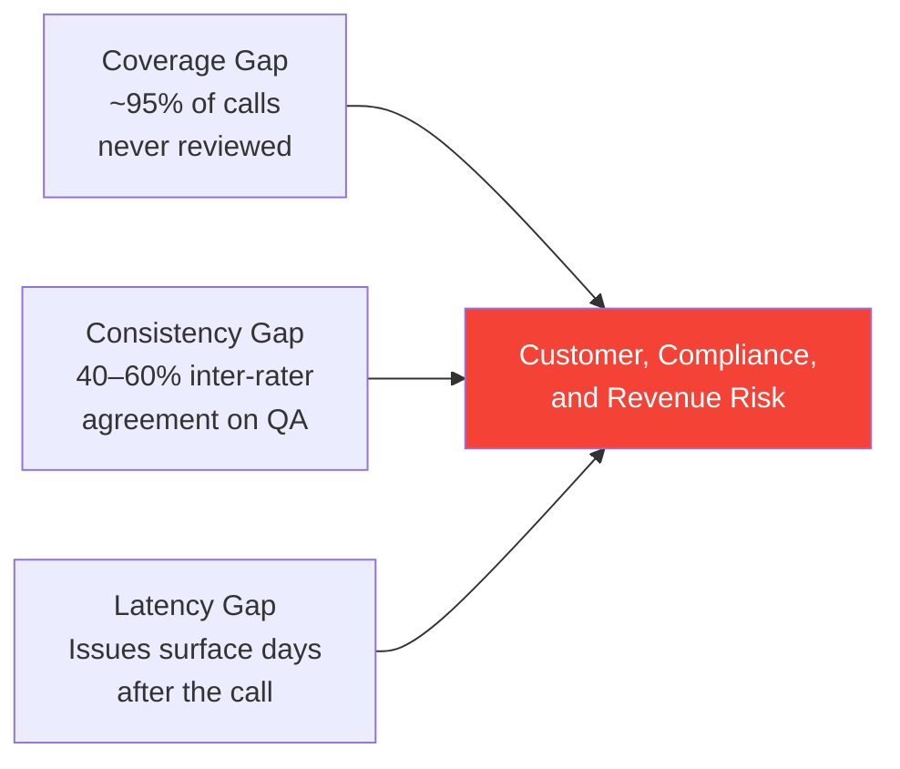
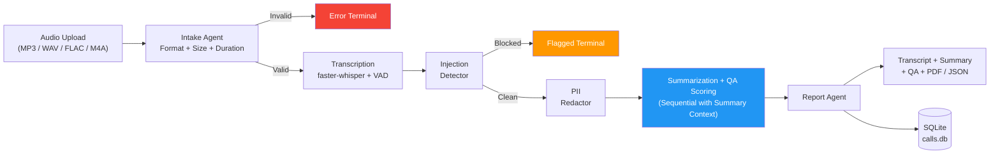
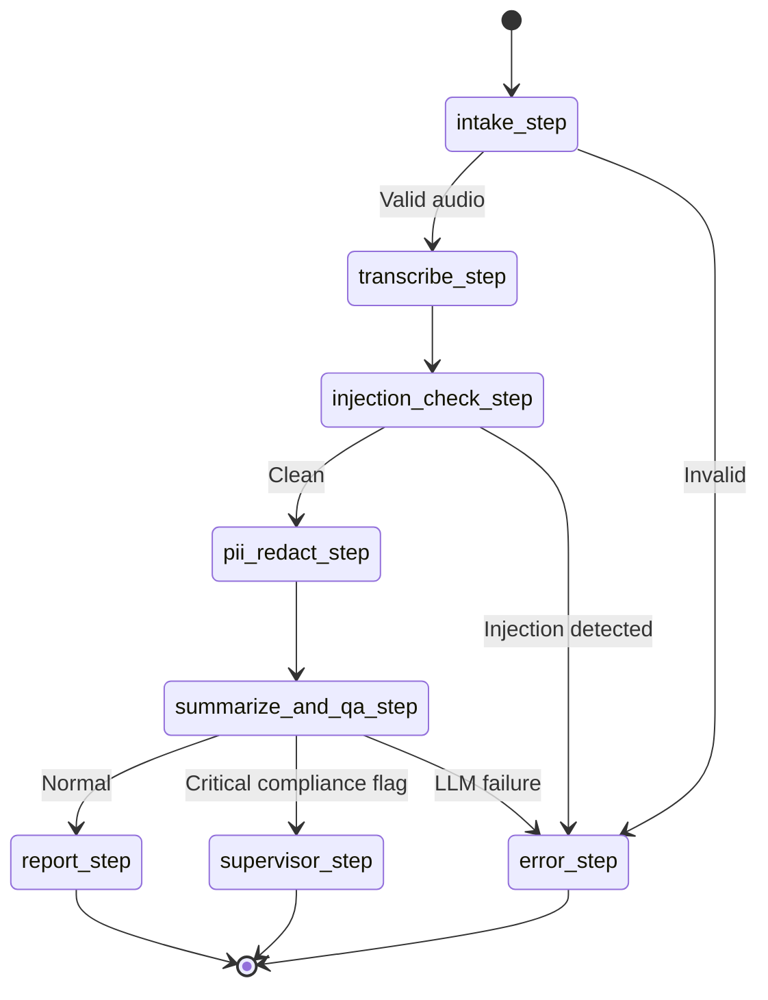
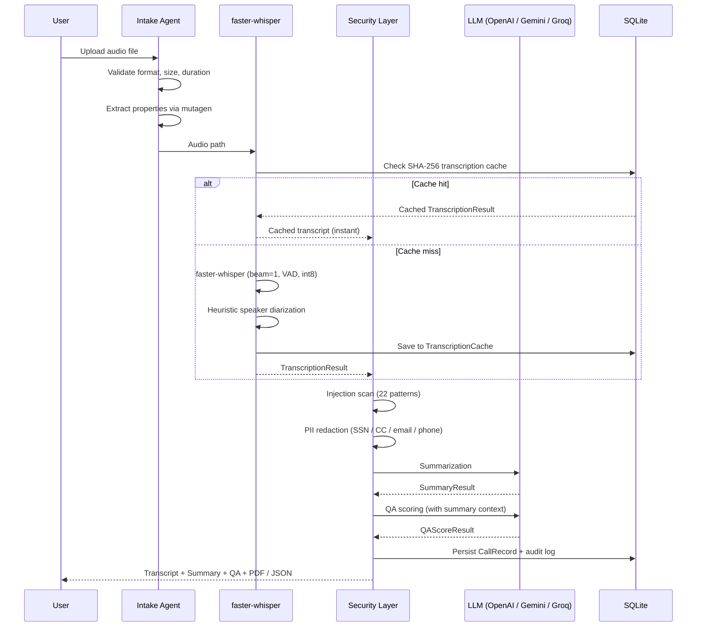
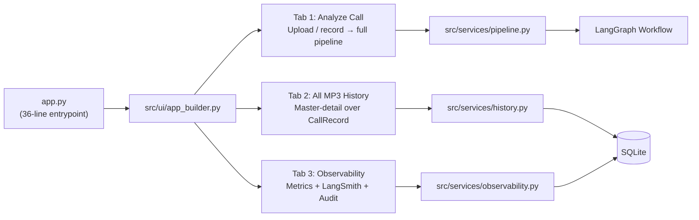
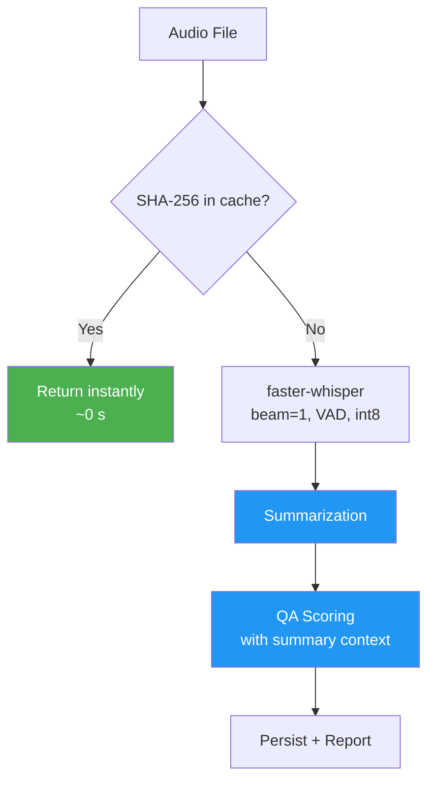
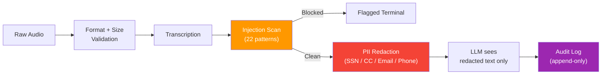

# Call Center Intelligence System

A production-grade, multi-agent AI platform that turns raw call center audio into structured transcripts, call summaries, weighted quality scores, compliance flags, and downloadable PDF / JSON reports.

The system is built on a **LangGraph** state machine, **faster-whisper** speech-to-text, and LangChain **structured output** over three interchangeable LLM providers (**OpenAI GPT-4o**, **Google Gemini 2.0 Flash**, and **Groq Llama 3.3 70B**). It ships with a 3-tab **Gradio** interface, an audit log, transcription caching, a PII redaction and prompt-injection defense layer, and 113 automated tests.

[](https://huggingface.co/spaces/animeshkcm/call-center-intelligence)
[](https://github.com/ANI-IN/Call-Center-Intelligence-System)
[](https://www.python.org/downloads/)
[]()
[](https://creativecommons.org/licenses/by-nc/4.0/)

## Capstone Framing

### Problem Statement

Build an automated, end-to-end quality assurance pipeline for call center operations, combining speech recognition, large language models, and structured data contracts into a single deployable application.

### Business Use Case

A mid-size call center handles roughly **5,000 calls per day**. Quality assurance teams typically review **fewer than 5%** of those calls and spend around 15 minutes per review. The result is three systemic failures:



| Metric | Manual QA | This System |
|---|---|---|
| Call coverage | < 5% | **100%** |
| Time per call | ~15 min | **2–5 min (CPU) / < 30s (GPU)** |
| Consistency | 40–60% agreement | **Deterministic weighted formula** |
| Compliance detection | Days later | **Real time, at ingestion** |
| Cost per call | ~$5 (labor) | **$0.03 (GPT-4o) / $0 (free tier)** |

### Evaluation Metrics

- **Coverage** — 100% of calls scored versus < 5% manual.
- **Consistency** — Deterministic weighted scoring (Professionalism 15%, Empathy 20%, Problem Resolution 30%, Compliance 20%, Communication Clarity 15%).
- **Speed** — 2–5 min on CPU, under 30 s with a GPU.
- **Cost** — $0.03 per call on GPT-4o, or zero on Gemini / Groq free tiers.
- **Security** — PII redacted before any LLM call; 22 prompt-injection patterns blocked at ingestion.
- **Reliability** — SHA-256 transcription cache, exponential backoff retries, graceful error routing via a dedicated error node.

### Why This Matters for AI Engineers

This project goes well beyond "wrap an LLM in an API" and demonstrates the engineering concerns that matter for Applied GenAI and Full Stack AI roles:

- **Multi-agent orchestration** — A LangGraph state machine with conditional routing, typed state, retry logic, and a dedicated error terminal.
- **Security-first design** — Injection detection and PII redaction are enforced *before* any transcript reaches the LLM.
- **Production patterns** — Model singletons, transcription caching, cached DB sessions, rolling temp-file cleanup, graceful degradation when the LLM fails.
- **Cost control** — Three providers switchable via a single `LLM_PROVIDER` env var, with zero code changes.
- **Clean architecture** — A 36-line entrypoint, clearly separated UI / services / agents / graph / database layers, and 113 tests across unit, integration, and security.

### Technical Complexity

| Dimension | Detail |
|---|---|
| Pipeline stages | 7 (intake, transcription, injection check, PII redaction, summarization, QA scoring, report) |
| Typed data contracts | 14 Pydantic models + 1 `StrEnum` in `src/graph/state.py` |
| LLM providers | 3 (OpenAI, Gemini, Groq) via a single factory |
| Security checks | 22 injection patterns + 4 PII types |
| Test coverage | 113 tests across `tests/unit/`, `tests/integration/`, and `tests/security/` |
| Architecture layers | 5 (UI, services, agents, graph, database) plus `utils/` and `security/` |

### The Engineering Challenge

This is not a single-prompt LLM wrapper — it solves five distinct engineering problems end to end:

1. **Audio-to-structured-data pipeline** — Raw telephony audio becomes typed Pydantic objects across 7 processing stages.
2. **Multi-agent coordination** — Conditional routing, typed state, retries, and error isolation via a LangGraph state machine.
3. **Security boundary enforcement** — PII redaction and injection detection run *between* transcription and any LLM call.
4. **Cost optimization** — Three LLM providers (one paid, two free) are interchangeable behind a single factory function.
5. **Production reliability** — Transcription caching, DB session pooling, temp-file lifecycle management, and a dedicated error node.

## System Architecture

### Pipeline Overview



> Summarization runs first. QA scoring then receives the summary as additional context for more accurate resolution and sentiment grounding.

### LangGraph State Machine



### Data Flow



### Application Flow (Gradio UI)



## Pipeline Stages

| # | Stage | What it does | Key detail |
|---|---|---|---|
| 1 | **Intake** | Validates format (magic bytes), size (< 50 MB), and duration (< 60 min). | Properties extracted via `mutagen` for MP3 / FLAC / M4A; `wave` for WAV. |
| 2 | **Transcription** | faster-whisper with int8 quantization, VAD filter, heuristic speaker diarization. | SHA-256 caching — identical audio returns instantly. |
| 3 | **Injection Detection** | Scans the transcript against 22 prompt-injection patterns. | Blocks malicious audio before it reaches any LLM. |
| 4 | **PII Redaction** | Redacts SSN, credit card, email, and phone numbers in both full text and per-segment text. | Runs before every LLM call; non-reversible at the downstream boundary. |
| 5 | **Summarization** | Extracts purpose, discussion points, action items, resolution status, sentiment trajectory, and entities. | Structured output via `with_structured_output(SummaryResult)`. |
| 6 | **QA Scoring** | Scores the agent on 5 weighted dimensions and emits compliance flags. | Receives the summary as context; overall score is recomputed deterministically from the weights. |
| 7 | **Report** | Compiles the `CallReport`, persists to SQLite, and generates PDF + JSON artifacts. | Audit event written on both success and failure paths. |

### QA Scoring Rubric

| Dimension | Weight | Measures |
|---|---|---|
| Professionalism | 15% | Tone, greeting / closing, etiquette. |
| Empathy | 20% | Active listening, acknowledgment of feelings. |
| Problem Resolution | 30% | Root cause, solution, confirmation. |
| Compliance | 20% | Disclosures, verification, hold procedures. |
| Communication Clarity | 15% | Clear explanations, jargon avoidance, pacing. |

The overall score is recomputed in Python from the dimension scores using the fixed weights above, rather than being trusted from the LLM output — a deterministic guardrail against scoring drift.

## Speed and Performance

### Processing Time by Hardware

| Hardware | 5-min call | 15-min call | Cost |
|---|---|---|---|
| CPU (HF Spaces free) | 2–4 min | 5–10 min | Free |
| NVIDIA T4 (HF Spaces) | 10–15 s | 25–40 s | $0.60 / hr |
| NVIDIA A10G (AWS / GCP) | 5–10 s | 15–25 s | ~$1 / hr |
| NVIDIA A100 (RunPod) | 3–5 s | 8–15 s | ~$2 / hr |

### Speed Optimizations



| Optimization | Impact | Detail |
|---|---|---|
| Greedy decoding (`beam_size=1`) | ~2× faster | Minimal quality loss on clear audio. |
| `condition_on_previous_text=False` | Prevents stalls | Avoids Whisper hallucination loops. |
| VAD filter | 20–30% faster | Skips silent segments. |
| int8 quantization | 2–4× faster on CPU | CTranslate2 backend with auto device detection. |
| Sequential LLM with context | Better QA accuracy | QA sees summary → better resolution grounding. |
| SHA-256 transcription cache | Instant on repeat | Identical audio skips transcription entirely. |
| No audio preprocessing | 30–60 s saved | faster-whisper handles resampling internally. |
| Cached DB session factories | Microseconds | `sessionmaker` reused per engine. |
| Transcript artifact cleaning | Cleaner LLM input | Strips `[BLANK_AUDIO]`, YouTube artifacts, repeat-phrase loops. |

### Whisper Model Comparison

| Model | Size | 10-min call on CPU | Accuracy | Best for |
|---|---|---|---|---|
| `tiny` | 39 MB | ~1 min | Good | Free tier / fast iteration (default). |
| `base` | 139 MB | ~3 min | Better | Balanced speed / accuracy. |
| `small` | 461 MB | ~8 min | High | Important calls with clear audio. |
| `large-v3` | 3 GB | ~25 min CPU / ~30 s GPU | Best | GPU deployments only. |

Recommendation: use `tiny` on the free CPU tier and `large-v3` with a GPU for production accuracy.

### GPU Deployment

On HuggingFace Spaces:

```
Space Settings -> Hardware -> T4 small ($0.60/hr)
Set env: WHISPER_MODEL_SIZE=large-v3
```

On RunPod or any CUDA host:

```bash
git clone https://github.com/ANI-IN/Call-Center-Intelligence-System.git
cd Call-Center-Intelligence-System
pip install -e .
export WHISPER_MODEL_SIZE=large-v3
export OPENAI_API_KEY=sk-...
python app.py
```

faster-whisper auto-detects CUDA via `torch.cuda.is_available()`; no code changes are required.

## Technology Stack

| Layer | Technology | Why |
|---|---|---|
| Orchestration | **LangGraph** | Typed state, conditional edges, dedicated error terminal. |
| Speech-to-Text | **faster-whisper** | CTranslate2 backend; int8 quantization; 2–4× faster than vanilla Whisper. |
| LLM (paid) | **OpenAI GPT-4o** | Best structured-output quality. |
| LLM (free) | **Google Gemini 2.0 Flash** | Generous free tier for development. |
| LLM (free) | **Groq Llama 3.3 70B** | Fastest hosted inference on Llama class models. |
| LLM Framework | **LangChain** | `with_structured_output` for Pydantic-enforced JSON. |
| Audio | **mutagen** + `wave` | Property extraction for MP3 / FLAC / M4A / WAV. |
| Data Models | **Pydantic v2** | 14 typed contracts between pipeline stages. |
| Database | **SQLite + SQLAlchemy 2.0** | `CallRecord`, `AuditLogEntry`, and `TranscriptionCache` tables. |
| Web UI | **Gradio 5.29** | 3-tab interface (Analyze, All MP3 History, Observability). |
| Observability | **LangSmith** | Per-node tracing via `@traceable`. |
| PDF | **ReportLab** | PDF report generation. |
| Testing | **pytest** | 113 tests across unit, integration, security. |
| Linting / Hooks | **ruff** + **pre-commit** + **detect-secrets** | Fast lint, format, and secret scanning. |

## Project Structure

```
call-center-intelligence/
├── app.py                              # 36-line entrypoint: build, compile, launch
├── pyproject.toml                      # Dependencies + tooling config
├── requirements.txt                    # Pinned deps for HF Spaces
├── Makefile                            # install / test / lint / format / run
├── .env.example                        # Env var template
│
├── src/
│   ├── agents/                         # Pipeline stages
│   │   ├── intake.py                   #   Validation + metadata PII scan
│   │   ├── transcription.py            #   faster-whisper + diarization + cache
│   │   ├── summarization.py            #   Structured summary extraction
│   │   ├── qa_scoring.py               #   5-dimension weighted scoring
│   │   └── report.py                   #   PDF / JSON + DB persistence
│   ├── graph/                          # LangGraph orchestration
│   │   ├── state.py                    #   Pydantic models (14 typed contracts)
│   │   ├── workflow.py                 #   State machine + nodes
│   │   └── edges.py                    #   Routing logic
│   ├── security/                       # Security layer
│   │   ├── pii_redactor.py             #   SSN / CC / email / phone redaction
│   │   ├── injection_detector.py       #   22 injection patterns
│   │   └── audit.py                    #   Append-only audit logging
│   ├── services/                       # Business logic (no UI deps)
│   │   ├── pipeline.py                 #   process_call orchestration
│   │   ├── history.py                  #   Read-only CallRecord access
│   │   └── observability.py            #   Metrics + LangSmith status
│   ├── ui/                             # Gradio presentation layer
│   │   ├── app_builder.py              #   Assembles all tabs
│   │   └── tabs/
│   │       ├── analyze.py              #   Tab 1: single call analysis
│   │       ├── history.py              #   Tab 2: master-detail history
│   │       └── observability.py        #   Tab 3: metrics dashboard
│   ├── database/                       # Persistence
│   │   ├── models.py                   #   ORM models
│   │   └── connection.py               #   Engine + session_scope
│   └── utils/                          # Shared utilities
│       ├── audio.py                    #   Format detection + mutagen
│       ├── config.py                   #   Env-based Config dataclass
│       ├── llm_factory.py              #   Multi-provider factory
│       └── formatters.py               #   Display formatting
│
├── data/
│   └── samples/                        # 10 sample MP3 call recordings
│
├── tests/                              # 113 tests
│   ├── conftest.py                     #   Shared fixtures
│   ├── unit/                           #   Agents, models, services, utils
│   ├── integration/                    #   End-to-end pipeline + DB
│   └── security/                       #   PII + injection suites
```

The architecture separates concerns across five layers: **UI** (`src/ui/`), **business logic** (`src/services/`), **agent pipeline** (`src/agents/`), **graph orchestration** (`src/graph/`), and **persistence** (`src/database/`), with cross-cutting concerns in `src/security/` and `src/utils/`. `app.py` is a thin 36-line entrypoint that loads config, initializes the DB, warms the Whisper model, compiles the workflow, and launches Gradio.

## Getting Started

### Prerequisites

- Python 3.11+
- `ffmpeg` (`brew install ffmpeg` / `apt install ffmpeg`)
- At least one LLM API key (OpenAI, Google, or Groq)

### Quick Start

```bash
git clone https://github.com/ANI-IN/Call-Center-Intelligence-System.git
cd Call-Center-Intelligence-System

python -m venv venv && source venv/bin/activate
pip install -e ".[dev]"

cp .env.example .env
# Set OPENAI_API_KEY, or set LLM_PROVIDER=gemini and GOOGLE_API_KEY,
# or set LLM_PROVIDER=groq and GROQ_API_KEY.

python app.py      # opens at http://localhost:7860
```

### Sample Dataset

The repo includes 10 sample call recordings in `data/samples/` for immediate testing:

```bash
ls data/samples/
# sample_01.mp3 through sample_10.mp3
```

Upload any of them to the **Analyze Call** tab to exercise the full pipeline.

### Developer Commands

```bash
make install           # pip install -e ".[dev]" + pre-commit install
make test              # unit + security tests
make test-integration  # pipeline + DB integration
make test-security     # PII + injection suites only
make test-all          # all 113 tests
make lint              # ruff check + format --check
make format            # ruff check --fix + ruff format
make typecheck         # mypy strict on src/
make secret-scan       # detect-secrets baseline scan
make run               # python app.py
```

## Configuration

### LLM Provider (pick one)

```bash
# OpenAI GPT-4o (default, ~$0.03 / call)
LLM_PROVIDER=openai
OPENAI_API_KEY=sk-...

# Gemini 2.0 Flash (free: ~1500 req/day)
LLM_PROVIDER=gemini
GOOGLE_API_KEY=AI...

# Groq Llama 3.3 70B (free: ~30 RPM)
LLM_PROVIDER=groq
GROQ_API_KEY=gsk_...
```

### Environment Variables

| Variable | Default | Description |
|---|---|---|
| `LLM_PROVIDER` | `openai` | `openai` / `gemini` / `groq` |
| `OPENAI_API_KEY` | — | Required when `LLM_PROVIDER=openai` |
| `GOOGLE_API_KEY` | — | Required when `LLM_PROVIDER=gemini` |
| `GROQ_API_KEY` | — | Required when `LLM_PROVIDER=groq` |
| `WHISPER_MODEL_SIZE` | `tiny` | `tiny` / `base` / `small` / `large-v3` |
| `LANGCHAIN_API_KEY` | — | LangSmith tracing (optional) |
| `LANGCHAIN_TRACING_V2` | `false` | Enable LangSmith tracing |
| `LANGCHAIN_PROJECT` | `call-center-intelligence` | LangSmith project name |
| `MAX_RETRIES_PER_NODE` | `3` | LLM retry attempts per node |
| `LLM_TIMEOUT_SECONDS` | `120` | LLM request timeout |
| `MAX_COST_PER_CALL_USD` | `2.00` | Soft ceiling surfaced in config |
| `CONFIDENCE_THRESHOLD` | `0.3` | Per-segment low-confidence threshold |
| `LOW_CONFIDENCE_HALT_RATIO` | `0.8` | Flag-for-review ratio of low-confidence segments |
| `DB_PATH` | `data/calls.db` | SQLite database path |
| `DB_ENCRYPTION_KEY` | auto | Optional SQLCipher key (falls back to plain SQLite) |

## Security



| Layer | Protection |
|---|---|
| **PII redaction** | SSN, credit card, email, and phone stripped from transcript and segments before any LLM call. |
| **Injection detection** | 22 regex patterns covering instruction override, role switching, prompt leaks, DAN mode, social engineering, and more. |
| **Audit logging** | Append-only `AuditLogEntry` rows with timestamp, action, and details. |
| **Temp-file cleanup** | Rolling cleanup keeps at most 50 in-flight temp files per process. |
| **Optional DB encryption** | Honors `DB_ENCRYPTION_KEY` via SQLCipher `PRAGMA key` when available. |

## Troubleshooting

| Problem | Fix |
|---|---|
| Processing takes > 10 min | Set `WHISPER_MODEL_SIZE=tiny` or attach a GPU. |
| Pipeline error after transcription | Check the configured LLM provider key and remaining credits. |
| Unsupported format | Supported formats are WAV, MP3, FLAC, and M4A. |
| HF Space stuck building | Verify required secrets are set in Space Settings. |
| Poor transcript quality | Upgrade to `WHISPER_MODEL_SIZE=small` or `large-v3`. |
| `OPENAI_API_KEY is not set` on startup | Either export the key or switch `LLM_PROVIDER` to `gemini` / `groq`. |

## Contributing

1. Fork the repo.
2. Create a feature branch: `git checkout -b feature/my-feature`.
3. Run the full suite: `make test-all`.
4. Run the linter: `make lint`.
5. Open a pull request.

All tests must pass and the code must satisfy the existing `ruff` configuration before review.

## License

Distributed under the **CC BY-NC 4.0** license (Attribution-NonCommercial 4.0 International).
