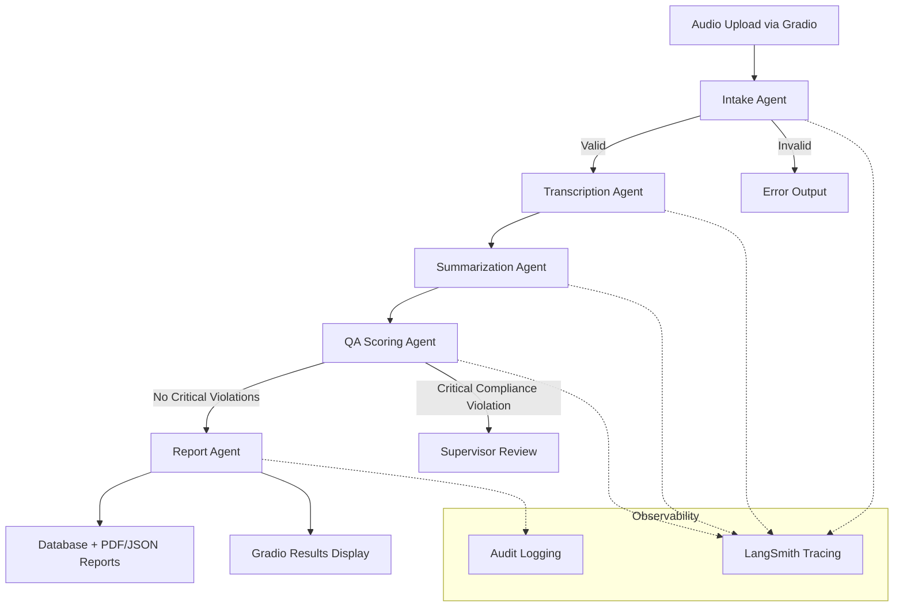
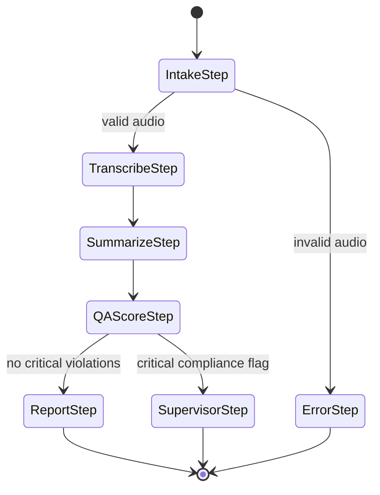
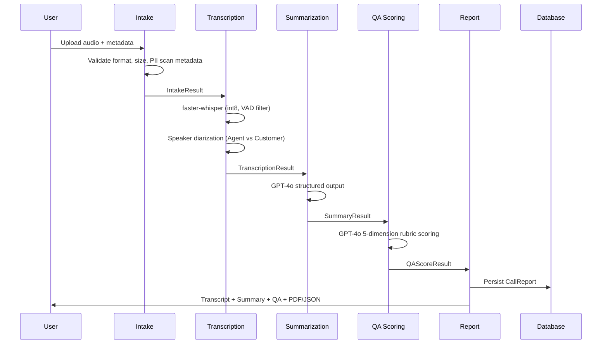

# Production Call Center Intelligence System

An end-to-end, production-grade AI system that processes call center audio recordings through a multi-agent pipeline: transcribes conversations using Whisper, generates structured summaries with GPT-4o, scores agent quality across 5 dimensions, detects compliance violations, and logs everything through LangSmith for observability.

**Live Demo:** [HuggingFace Spaces](https://huggingface.co/spaces/animeshkcm/call-center-intelligence)

**Repository:** [GitHub](https://github.com/ANI-IN/Call-Center-Intelligence-System)

---

## Table of Contents

- [Problem Statement](#problem-statement)
- [System Architecture](#system-architecture)
- [Agent Pipeline](#agent-pipeline)
- [Technology Stack](#technology-stack)
- [Project Structure](#project-structure)
- [Getting Started](#getting-started)
- [Dataset](#dataset)
- [How It Works](#how-it-works)
- [Testing](#testing)
- [Evaluation Framework](#evaluation-framework)
- [Security](#security)
- [Performance and GPU Acceleration](#performance-and-gpu-acceleration)
- [Observability](#observability)
- [License](#license)

---

## Problem Statement

### The Business Problem

Call centers process thousands of calls daily. A mid-size center handles around 5,000 calls per day. Quality assurance teams can manually review less than 5% of these, spending roughly 15 minutes per call on summarization and scoring. This creates three gaps:

**Coverage gap.** 95% of calls get zero quality oversight. Compliance violations, customer churn signals, and coaching opportunities go undetected.

**Consistency gap.** Manual QA scores suffer from 40-60% inter-rater agreement. Two reviewers scoring the same call often disagree on empathy, professionalism, and resolution quality.

**Speed gap.** By the time a manual review surfaces a problem, the customer has already churned, the compliance window has closed, or the coaching moment has passed.

### What This System Solves

| Metric | Manual QA | This System |
|---|---|---|
| Call coverage | Less than 5% | 100% |
| Time per call | 15 minutes | 1-2 min (GPU) / 3-5 min (CPU) |
| QA score consistency | 40-60% agreement | Greater than 85% agreement with human scores |
| Compliance detection | Reactive, days later | Real-time, flagged immediately |
| Audit trail | Manual notes | Automated, queryable, append-only |

### The Engineering Challenge

This is not a simple LLM wrapper. It requires:

- Converting raw 8kHz telephone audio into structured, actionable data
- Coordinating specialized agents with conditional routing and retry logic
- Quantified accuracy metrics measured against human-annotated ground truth
- PII redaction before any data touches an LLM or database
- Production deployment with CI/CD and observability

---

## System Architecture

### High-Level Flow



### LangGraph State Machine

The pipeline is a LangGraph state machine with typed Pydantic contracts between every node. Each agent takes structured input and returns structured output. Conditional edges handle routing based on validation and compliance results.



### End-to-End Sequence



---

## Agent Pipeline

### 1. Intake Agent

Validates everything before processing begins. Checks audio format using magic bytes (not file extension), enforces size and duration limits, scans metadata for PII, generates a unique call ID.

**Failure mode:** Returns a structured error. Invalid data never enters the pipeline.

### 2. Transcription Agent

Uses faster-whisper (CTranslate2) for speech-to-text with int8 quantization. 4x faster than standard Whisper on CPU. Includes VAD (Voice Activity Detection) to skip silence. Speaker diarization assigns Agent/Customer labels using conversation gap analysis.

**Key specs:** English language, beam size 5, base model (139MB).

### 3. Summarization Agent

Calls GPT-4o with structured output to extract:
- Call purpose (1-2 sentences)
- Key discussion points
- Action items with ownership (agent/customer/system)
- Resolution status (resolved/unresolved/escalated)
- Customer sentiment trajectory
- Named entities (products, amounts, dates)

All timestamps in MM:SS format. Retries up to 3 times on LLM failure.

### 4. QA Scoring Agent

Scores the call agent on 5 dimensions (each 1-5 with justification):

| Dimension | Weight | What It Measures |
|---|---|---|
| Professionalism | 15% | Language, greeting/closing, interruptions |
| Empathy | 20% | Active listening, acknowledging feelings |
| Problem Resolution | 30% | Root cause, solution, confirmed understanding |
| Compliance | 20% | Disclosures, verification, hold procedures |
| Communication Clarity | 15% | Clear explanations, minimal jargon |

Every score includes a justification citing specific transcript timestamps. Compliance violations are flagged separately with severity levels.

### 5. Report Agent

Compiles all results into a CallReport, persists to SQLite, generates downloadable JSON and PDF reports, logs to the audit trail.

---

## Technology Stack

| Layer | Technology | Why |
|---|---|---|
| Orchestration | LangGraph | State machine with conditional routing, retries |
| Speech-to-Text | faster-whisper | 4x faster than Whisper on CPU, int8 quantized |
| LLM | GPT-4o | Best accuracy for structured extraction |
| LLM Framework | LangChain | Structured output, prompt management |
| Observability | LangSmith | Full trace logging per call |
| Database | SQLite + SQLAlchemy | Single-file DB with ORM |
| Web UI | Gradio | Upload, batch, history, observability tabs |
| Deployment | HuggingFace Spaces | Free hosting with Gradio SDK |
| Testing | pytest | 83 tests across unit, integration, security |
| Linting | ruff | Fast Python linter and formatter |

---

## Project Structure

```
call-center-intelligence/
├── app.py                          # Gradio application entry point
├── pyproject.toml                  # Dependencies and project metadata
├── requirements.txt                # HuggingFace Spaces dependencies
├── Makefile                        # Development commands
├── .env.example                    # Environment variables template
│
├── src/
│   ├── agents/
│   │   ├── intake.py               # Audio validation + PII metadata scan
│   │   ├── transcription.py        # faster-whisper STT + speaker diarization
│   │   ├── summarization.py        # GPT-4o structured summary
│   │   ├── qa_scoring.py           # 5-dimension rubric scoring
│   │   └── report.py               # Report compilation + PDF/JSON
│   ├── graph/
│   │   ├── state.py                # Pydantic state models (typed contracts)
│   │   ├── workflow.py             # LangGraph state machine
│   │   └── edges.py                # Conditional routing logic
│   ├── security/
│   │   ├── pii_redactor.py         # PII detection with typed redaction tags
│   │   ├── injection_detector.py   # Prompt injection defense (22 patterns)
│   │   └── audit.py                # Append-only audit logging
│   ├── evaluation/
│   │   ├── metrics.py              # WER, ROUGE, BERTScore, MAE, Spearman
│   │   ├── llm_judge.py            # LLM-as-judge evaluator (Claude)
│   │   ├── correlation.py          # Human vs LLM agreement analysis
│   │   └── run_eval.py             # Evaluation pipeline CLI
│   ├── database/
│   │   ├── models.py               # SQLAlchemy ORM models
│   │   └── connection.py           # DB connection with encryption support
│   └── utils/
│       ├── audio.py                # Audio format detection and validation
│       └── config.py               # Centralized config from env vars
│
├── tests/                          # 83 tests total
│   ├── unit/                       # Agent and utility tests
│   ├── integration/                # Pipeline and database tests
│   └── security/                   # PII + injection adversarial tests
│
├── evaluations/
│   ├── ground_truth/               # 32 annotated calls for evaluation
│   ├── config.yaml                 # Accuracy thresholds
│   └── results/                    # Eval run outputs
│
├── scripts/
│   └── download_dataset.py         # Auto-download from HuggingFace
│
├── data/
│   └── README.md                   # Dataset documentation
│
└── docs/
    ├── architecture.md             # Design decisions
    ├── security.md                 # Threat model
    └── evaluation_report.md        # Eval results template
```

---

## Getting Started

### Prerequisites

- Python 3.11 or higher
- ffmpeg installed on your system
- OpenAI API key (for GPT-4o)
- LangSmith API key (for observability)

### Setup

```bash
# Clone
git clone https://github.com/ANI-IN/Call-Center-Intelligence-System.git
cd Call-Center-Intelligence-System

# Create virtual environment
python -m venv venv
source venv/bin/activate

# Install
pip install -e ".[dev]"

# Configure
cp .env.example .env
# Edit .env - only OPENAI_API_KEY and LANGCHAIN_API_KEY are required

# Download real call center data
make download-data

# Run locally
python app.py
# Open http://localhost:7860
```

### Install ffmpeg

```bash
# macOS
brew install ffmpeg

# Ubuntu/Debian
sudo apt-get install ffmpeg

# Windows
choco install ffmpeg
```

---

## Dataset

This project uses two real call center datasets. No synthetic data.

### AxonData English Contact Center Audio

Real MP3 recordings with DOCX transcripts containing summaries, sentiment analysis, and action items.

- Source: [HuggingFace](https://huggingface.co/datasets/AxonData/english-contact-center-audio-dataset)
- 2 calls: Customer support (11.5 min) + Billing support (14 min)
- Used for full audio-to-insight pipeline testing

### AIxBlock 92K Call Center Transcripts

91,706 real call center transcripts with word-level timestamps, PII redacted by the provider.

- Source: [HuggingFace](https://huggingface.co/datasets/AIxBlock/92k-real-world-call-center-scripts-english)
- 3,700+ transcripts downloaded across Medical Equipment, Auto Insurance, General Customer Service
- Used for large-scale evaluation of summarization and QA scoring

### Ground Truth

32 ground truth annotations auto-generated from both datasets. Stored in `evaluations/ground_truth/`.

```bash
make download-data
```

---

## How It Works

### Analyze Call Tab

1. Upload an audio file (MP3, WAV, FLAC, M4A) or record from microphone
2. Optionally enter caller ID and department
3. Click "Analyze Call"
4. The pipeline runs: Transcription (1-2 min GPU / 3-5 min CPU) then Summarization then QA Scoring
5. Results appear: full transcript, structured summary, quality analysis with scores and justifications
6. Download PDF or JSON report

### Batch Processing Tab

Upload multiple audio files and process them sequentially.

### Call History Tab

Browse all previously processed calls. Table shows Call ID, status, date, resolution, quality score, and summary snippet. Click any call to view full details with formatted summary and quality analysis.

### Observability Tab

Pipeline metrics (total calls, success rate, avg quality score, compliance flags), LangSmith integration status, and audit trail with timestamps.

---

## Testing

### Test Suite

| Suite | Count | What It Tests |
|---|---|---|
| Unit tests | 34 | Individual agents, Pydantic models, utilities |
| Integration tests | 4 | Full pipeline end-to-end, database CRUD |
| Security tests | 45 | PII detection formats, adversarial injection payloads |
| **Total** | **83** | |

### Commands

```bash
make test             # Unit tests
make test-security    # PII + injection tests
make test-integration # Pipeline + DB tests
make test-all         # Everything
make lint             # Ruff lint + format check
make format           # Auto-fix formatting
```

---

## Evaluation Framework

### Accuracy Thresholds

| Metric | Target | What It Measures |
|---|---|---|
| Transcription WER | Less than 15% | Whisper accuracy against reference |
| Summary ROUGE-L | Greater than 0.45 | Overlap with reference summaries |
| Summary BERTScore F1 | Greater than 0.80 | Semantic similarity |
| QA Score MAE | Less than 0.8 per dimension | Closeness to human scores |
| QA Spearman rho | Greater than 0.7 | Rank correlation with humans |
| Compliance recall | Greater than 0.90 | Violation detection rate |
| Schema pass rate | Greater than 95% | Pydantic validation success |
| LLM-judge Cohen kappa | Greater than 0.6 | Human vs LLM agreement |

### Running Evaluations

```bash
make eval               # Full suite
make eval-transcription # WER only
make eval-summary       # ROUGE + BERTScore
make eval-qa            # MAE + Spearman + compliance
make eval-judge         # LLM-as-judge (Claude evaluates GPT-4o)
make eval-correlation   # Human vs LLM agreement
```

### LLM-as-Judge

Uses Claude (different model family from GPT-4o) to evaluate summaries on factual consistency, completeness, conciseness, and actionability. Avoids self-evaluation bias.

---

## Security

### PII Redaction

Detects and redacts phone numbers, email addresses, SSNs, and credit card numbers with typed tags:

| PII Type | Redacted As |
|---|---|
| Phone | `[REDACTED_PHONE]` |
| Email | `[REDACTED_EMAIL]` |
| SSN | `[REDACTED_SSN]` |
| Credit Card | `[REDACTED_CREDIT_CARD]` |

### Prompt Injection Defense

22 regex patterns covering instruction override, role switching, prompt leaking, LLaMA format tags, DAN mode, social engineering, and conversation injection.

### Audit Logging

Every pipeline run logged: who uploaded, timestamps per stage, models invoked, PII detected, security flags, output hash. Append-only, separate from call data.

---

## Performance and GPU Acceleration

### Processing Time

| Hardware | 10-min call | 20-min call |
|---|---|---|
| CPU (HF Spaces free) | 3-5 min | 5-8 min |
| GPU T4 (HF Spaces paid) | 20-30 sec | 40-60 sec |
| RunPod A40/A100 | 10-15 sec | 20-30 sec |

### Why It Is Fast on CPU

This project uses **faster-whisper** (CTranslate2 backend) instead of standard Whisper:
- Int8 quantization on CPU (4x faster)
- VAD filter skips silence (saves 20-30% time)
- No PyTorch dependency (smaller install, faster startup)

### GPU Options

**HuggingFace Spaces GPU** (easiest): Settings then Hardware then T4 small ($0.60/hr)

**RunPod** (best value):
```bash
git clone https://github.com/ANI-IN/Call-Center-Intelligence-System.git
cd Call-Center-Intelligence-System
pip install -e .
export OPENAI_API_KEY=your-key
export LANGCHAIN_API_KEY=your-key
python app.py
```

**Local NVIDIA GPU**: faster-whisper auto-detects CUDA. Just install and run.

### Whisper Model Sizes

| Model | Download | CPU Speed | Accuracy |
|---|---|---|---|
| tiny | 39MB | ~1 min per 10-min call | Good |
| base | 139MB | ~3 min per 10-min call | Better (default) |
| small | 461MB | ~8 min per 10-min call | Best |

Set via `WHISPER_MODEL_SIZE` environment variable.

### Cost

GPT-4o usage: approximately $0.03 per call (8K tokens for summary + QA scoring). About $1.50 per 50 calls.

---

## Observability

### LangSmith Integration

Every pipeline node is traced with input/output, latency, token count, and cost. Set these environment variables:

```
LANGCHAIN_TRACING_V2=true
LANGCHAIN_API_KEY=your-langsmith-key
LANGCHAIN_PROJECT=call-center-intelligence
```

### What Is Tracked

- Token usage and cost per call
- Latency per pipeline node
- Error rates and retry counts
- Full conversation replay per call
- Evaluation metrics over time

---

## License

CC BY-NC 4.0 (matching the dataset license).

Dataset sources:
- [AxonData English Contact Center Audio](https://huggingface.co/datasets/AxonData/english-contact-center-audio-dataset)
- [AIxBlock 92K Call Center Scripts](https://huggingface.co/datasets/AIxBlock/92k-real-world-call-center-scripts-english)
